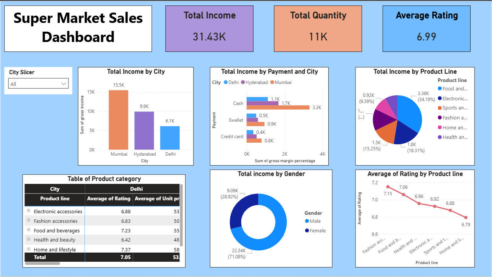

# supermarket-sales-dashboard
Power BI dashboard for sales analysis

# 📊 Supermarket Sales Dashboard (Power BI)

## 📌 Problem Statement

Realmart aims to expand its business by opening a new branch but lacks clarity on the most profitable location, customer behavior, and product performance.

This project analyzes historical sales data—including customers, products, quantity, tax, payment methods, ratings, and profit—to generate insights that support strategic decision-making.

---

## 🎯 Objective

The objective is to build an interactive Power BI dashboard that:

* Provides actionable insights into sales performance
* Identifies key revenue drivers
* Analyzes customer behavior
* Supports data-driven expansion decisions

---

## ❓ Key Business Questions

* Which city is best for opening a new branch?
* What are the top-performing product categories?
* Which payment methods do customers prefer?
* How do customer ratings vary?
* Which customer segment drives the most revenue?

---

## 📈 Key Insights

* Mumbai leads in total revenue
* Cash payments dominate across cities
* Female customers contribute the majority of income
* Product categories show varied performance and satisfaction levels

---

## 🛠️ Tools Used

* Power BI
* Data Cleaning & Transformation
* Data Visualization

---

## 📷 Dashboard Preview

---

## 🚀 How to Use

1. Download the `.pbix` file
2. Open in Power BI Desktop
3. Interact with slicers and visuals

---

## 💡 Conclusion

This dashboard helps Realmart make informed, data-driven decisions for business expansion and performance improvement.

---

## 📬 Feedback

Feel free to suggest improvements or raise issues!
